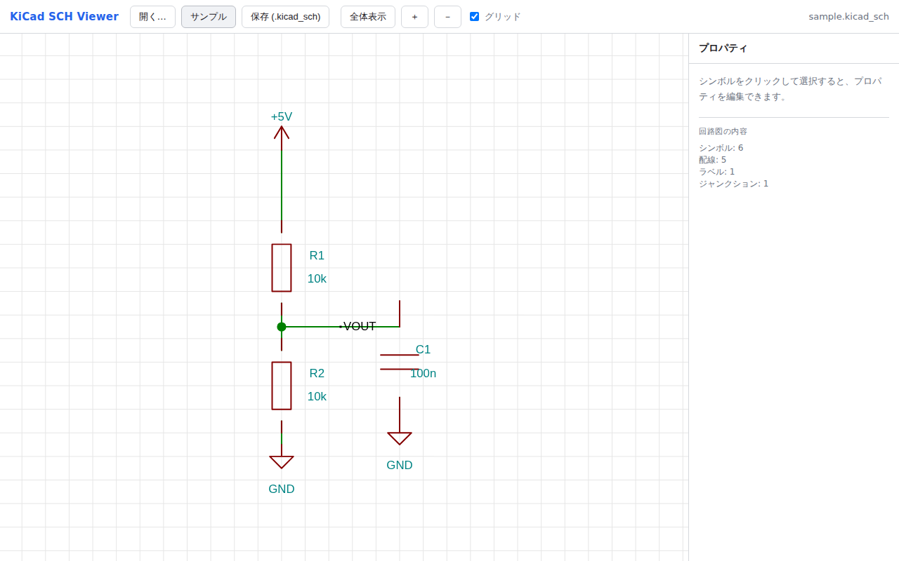
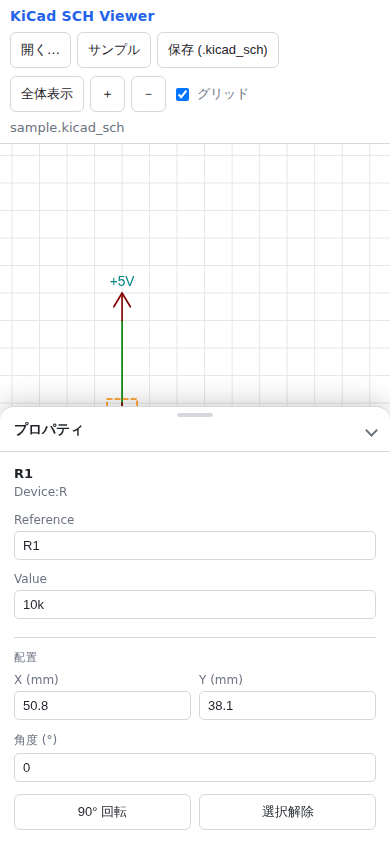

# KiCad Schematic Viewer / Editor

ブラウザだけで動作する、KiCad の回路図ファイル (`.kicad_sch`) の閲覧・基本編集アプリです。
ビルド不要・依存パッケージなしの純粋な HTML / CSS / JavaScript で構成されています。

<p>
  
  
</p>

## 特徴

- **S 式パーサ / シリアライザ** — `.kicad_sch`（KiCad 6/7/8 の S 式フォーマット）を解析し、
  編集後に再度 `.kicad_sch` として書き出します。解析ツリーをそのまま保持するため、
  編集していない部分は元の値を保ったまま往復（ラウンドトリップ）します。
- **KiCad 忠実レンダリング** — 配線・バス・**バスエントリ**・シンボル（`lib_symbols` を解決して
  図形描画）・ピン・ジャンクション・ラベル・ノーコネクト・テキスト・シート（**シートピン**含む）を
  Canvas に描画。ライブラリ座標系（+Y 上）→ シート座標系（+Y 下）の変換、回転・ミラーに対応。
  - **図枠とタイトルブロック**: 用紙サイズ（A0〜A5・縦横）の外形/内枠・ゾーン参照
    （1,2,3…/A,B,C…）・title_block（タイトル/会社名/Rev/日付）を KiCad 様式で描画
  - **ドットグリッド**、KiCad 既定のテーマ配色
  - **ピンの忠実描画**: ピン番号は線に沿って上側、ピン名はボディ内側（offset 対応）、
    inverted のバブル・clock のマークにも対応
  - **ラベル形状**: グローバルラベルは shape（input/output/bidirectional 等）に応じた
    尖ったフラグ形、階層ラベルは五角形マーク付き
  - **未接続インジケータ**: 浮いている配線端に小さな四角、未接続ピン先端に小さな円を表示
  - **選択ハイライト**: 選択アイテム自体を KiCad 風の半透明ハローで強調
  - **中ボタンドラッグでパン**（KiCad 操作）
- **編集**
  - すべてのアイテム（シンボル・配線・バス・ラベル・テキスト・ジャンクション・
    ノーコネクト）をクリック / タップで選択、Shift+クリックで追加選択、
    Shift+ドラッグで範囲選択
  - ドラッグで移動（1.27 mm グリッドにスナップ、複数選択の一括移動対応）
  - 90° 回転（R キー）、左右 / 上下反転（Y / X キー）、削除（Delete）
  - `Reference` / `Value` などプロパティ・ラベル文字列の編集、X / Y / 角度の数値入力
  - **フットプリントの設定**: シンボル選択時のパネルに Footprint 欄を常時表示。
    参照プレフィックスに応じた定番候補に加え、**KiCad 公式フットプリントライブラリ全量
    （約 150 ライブラリ・約 1.5 万種）**を 2 文字以上の入力で横断検索して補完入力
    （索引は初回フォーカス時に遅延取得、自由入力も可）。プロパティが無いシンボルには
    確定時に自動生成（KiCad 同様にシート上は既定非表示）
  - **Undo / Redo**（Ctrl+Z / Ctrl+Y、ツールバーのボタンでも可）
  - **コピー & ペースト / 複製**（Ctrl+C / Ctrl+X / Ctrl+V / D キー、パネルの「複製」ボタン）。
    ペーストは UUID 再生成・参照番号の自動再採番（R1 → R3）・+2.54mm オフセット配置で、
    貼り付け後は選択状態のままドラッグで移動可能
  - `.kicad_sch` 形式でダウンロード保存
- **新規描画（配置ツール）**
  - **配線 / バス**: クリックで頂点を置き水平/垂直セグメントを描画（W キー、Esc で終了）。
    T 字接続には**ジャンクションを自動挿入**
  - **ラベル / グローバルラベル**: クリック配置 → パネルで名前編集（L キー）
  - **電源シンボル**: GND / +5V / +3V3 / +12V / VCC をドロップダウンから選んで配置
    （ライブラリ定義はファイルに自動埋め込み）
  - **ジャンクション / ノーコネクト / テキスト** の配置
- **ライブラリからの部品配置**
  - 「部品を配置…」から標準部品を選択 → クリックで配置（連続配置可）。参照番号
    （R1, R2, D1, Q1…）は種別ごとに**自動採番**、ライブラリ定義はファイルに自動埋め込み
  - 内蔵部品（30 種類以上）: 抵抗 / コンデンサ / 電解コンデンサ / インダクタ /
    フェライトビーズ / ヒューズ / 水晶発振子 / ダイオード / LED / ツェナーダイオード /
    ショットキーダイオード / NPN・PNP トランジスタ / N・P チャネル MOSFET /
    3端子レギュレータ / オペアンプ / ロジックゲート(AND/NAND/OR/NOT) /
    プッシュスイッチ / リレー(SPDT) / ブザー / コネクタ(2〜10ピン) / テストポイント
  - 部品チューザは名前で**絞り込み検索**が可能。部品をタップすると**シンボルの
    プレビュー**（記号図・説明・既定フットプリント）が表示され、確認してから配置できる
  - **KiCad 公式フル標準ライブラリ**（約 220 ライブラリ・数万シンボル）を検索・配置可能。
    デプロイ時に [KiCad Symbol Libraries](https://gitlab.com/kicad/libraries/kicad-symbols)
    （CC-BY-SA 4.0）を同梱し、検索索引は初回利用時のみ・各ライブラリは配置時に遅延取得
    （一度使ったライブラリはオフラインでも利用可）。`extends` 派生シンボルは
    親定義とマージして平坦化、既定フットプリントも自動で引き継ぎ。
    フットプリント名の索引は [KiCad Footprint Libraries](https://gitlab.com/kicad/libraries/kicad-footprints)
    （CC-BY-SA 4.0）から同様にデプロイ時に生成
  - 手持ちの **`.kicad_sym` ファイルを取り込み**、その中のシンボルも配置可能
- **表示項目の切り替え**（ツールバー「表示項目…」）
  - Reference / Value / Footprint / Datasheet / Description など、シンボルの
    プロパティ種別ごとに回路図上への表示・非表示を選択可能。実機の KiCad ファイルでは
    複数フィールドが同じ位置に配置され文字が重なることがあるため、既定では
    **Reference と Value のみ表示**し、他は非表示にして見やすくしている
    （ファイル内のデータ・配置には影響しない、表示だけの設定）
- **操作**
  - PC: マウスホイールでズーム、空白ドラッグでパン、シンボルドラッグで移動、「全体表示」でフィット
  - スマホ / タブレット（レスポンシブ対応）: 1 本指ドラッグでパン、2 本指ピンチでズーム、
    タップで選択。プロパティは下部シート（画面下から引き出すパネル）で編集。
    移動は「タップで選択 → そのシンボルをドラッグ」で行い、誤操作を防止。

## PWA（アプリとしてインストール）

PWA 対応です。公開 URL をスマホ / PC のブラウザで開き、
**「ホーム画面に追加」（iOS Safari）** または **インストールアイコン（Chrome/Edge）** で
アプリとしてインストールできます。

- 全画面のスタンドアロン表示（ブラウザ UI なし）
- **オフライン動作**（サービスワーカーが本体をキャッシュ。オンライン時は常に最新版を取得）
- 対応環境（Chromium 系デスクトップ）では `.kicad_sch` の**ファイル関連付け**からアプリで直接開ける

## 使い方

静的ファイルなので、ローカルの Web サーバで開くのが確実です。

```bash
# リポジトリのルートで
python3 -m http.server 8000
# ブラウザで http://localhost:8000/ を開く
```

`file://` で `index.html` を直接開いても多くのブラウザで動作します。

1. 「サンプル」ボタンでデモ回路（分圧回路）を表示、または
2. 「開く…」で手元の `.kicad_sch` を選択、あるいはファイルをドラッグ＆ドロップ
3. シンボルをクリックして選択 → 右パネルで編集 / ドラッグで移動
4. 「保存 (.kicad_sch)」で書き出し

`samples/sample.kicad_sch` に実ファイルのサンプルを同梱しています。

## プロジェクト構成

| ファイル | 役割 |
| --- | --- |
| `index.html` | 画面レイアウト |
| `css/style.css` | スタイル |
| `js/sexpr.js` | S 式パーサ / シリアライザ |
| `js/model.js` | ツリー上の構造化アクセスと `lib_symbols` 解析 |
| `js/renderer.js` | Canvas レンダラ（座標変換・シンボル描画） |
| `js/app.js` | UI 制御（読み込み・パン/ズーム・選択・移動・編集・保存） |
| `js/sample.js` | サンプル回路データ |
| `samples/sample.kicad_sch` | サンプルの実ファイル |

## 制限事項 / 今後の拡張候補

- 閲覧 + 基本編集の範囲です。以下は未対応（今後の拡張候補）:
  - 配線・シンボルの新規追加 / 削除
  - 複数選択、コピー & ペースト、Undo / Redo
  - 階層シートの中への移動（子シートを開く）
  - ミラー編集 UI（保存フォーマット上のミラーは描画のみ対応）
  - ERC / ネットリスト
- 保存時の整形（インデント）は KiCad と完全一致ではありませんが、有効な S 式のため
  KiCad で問題なく開けます。編集していない値は元の表記を保持します。
